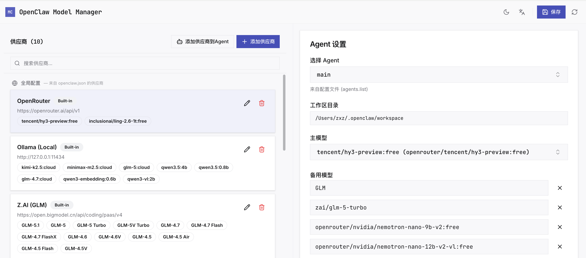

# OpenClaw Model Manager 中文

<p align="right">
  <a href="#openclaw-model-manager">English</a> | <a href="#openclaw-model-manager-中文">中文</a>
</p>


[](LICENSE)
[](https://nodejs.org)
[](CONTRIBUTING.md)
[](https://github.com/xinzhuang/openclaw-model-manager)

专为 [OpenClaw](https://github.com/openclaw/openclaw) AI Agent 设计的可视化模型配置管理工具。通过简洁的 Web Dashboard，轻松管理全局模型供应商、模型参数及 Agent 绑定配置。

> 本项目受 [claude-code-router](https://github.com/musistudio/claude-code-router) 项目启发。

---

## 截图




## 功能特性

- **供应商管理** — 配置内置供应商（OpenAI、Anthropic、Google Gemini 等）或添加自定义供应商（自定义 Base URL 和 API 类型）
- **模型管理** — 添加模型并配置推理支持、视觉（图片理解）、上下文窗口、最大 Token 等参数
- **Agent 模型绑定** — 为每个 Agent 绑定主模型与备用模型链，配置图片模型与推理等级
- **认证状态查看** — 查看并监控各 Agent 的认证配置，包括过期状态
- **双语界面** — 支持中英文切换（English / 中文），基于 i18n
- **单文件构建** — 生产构建输出单个 HTML 文件，所有资源内联（via `vite-plugin-singlefile`）
- **原子化配置写入** — 安全的配置文件更新，自动备份（保留最近 5 份）并支持乐观锁机制

## 快速开始

### 安装

```bash
git clone https://github.com/xinzhuang/openclaw-model-manager.git
cd openclaw-model-manager
npm install
npm link
```

安装后 `omm` 命令全局可用。如需开发模式（热重载），可使用 `npm run dev` 启动。

### 使用

```bash
omm start    # 启动服务器并打开浏览器
omm stop     # 停止运行中的服务器
omm status   # 查看服务器状态
```

## 项目架构

```
┌──────────────────────────────────────────────┐
│                  浏览器                      │
│                                              │
│  React SPA（Vite 开发 / 单文件构建）          │
│  ├── Dashboard（供应商 | Agent）              │
│  ├── ConfigProvider（全局状态）               │
│  └── i18n（en / zh）                       │
└─────────────────────┬────────────────────────┘
                      │ REST API
┌─────────────────────▼────────────────────────┐
│              Express 后端（:3457）              │
│                                              │
│  /api/config ◀─ server/routes/config.ts       │
│  ├── GET  /config          → 读取配置        │
│  ├── POST /config         → 写入配置         │
│  ├── PATCH /config       → 合并配置         │
│  └── /config/agents/...  → Agent 专属 API  │
│                                              │
│  server/utils/config.ts → ~/.openclaw/openclaw.json │
└──────────────────────────────────────────────┘
```

### 配置文件说明

| 文件 | 用途 |
|------|------|
| `~/.openclaw/openclaw.json` | 全局供应商配置（models.providers） |
| `~/.openclaw/agents/{id}/agent/models.json` | Agent 独立供应商配置 |
| `~/.openclaw/agents/{id}/agent/auth-profiles.json` | Agent 认证凭据存储 |

详见 [docs/model-provider-config-logic.md](docs/model-provider-config-logic.md) 了解完整配置逻辑。

## 可用命令

| 命令 | 说明 |
|------|------|
| `npm run dev` | 启动后端 + 前端（开发模式） |
| `npm run dev:ui` | 仅启动 Vite 开发服务器（端口 7123） |
| `npm run dev:server` | 仅启动 Express 后端（端口 3457，tsx watch） |
| `npm run build` | 构建生产版本（单 HTML 文件，输出到 `dist/`） |
| `npm start` | 生产模式：Express 同时提供前端 + API |
| `npm run cli` | 执行 CLI 命令（如 `npm run cli -- start`） |

## 配置说明

OpenClaw Model Manager 编辑标准 OpenClaw 配置结构：

```json5
{
  "models": {
    "mode": "merge",
    "providers": {
      "zai": {
        "baseUrl": "https://open.bigmodel.cn/api/paas/v4",
        "apiKey": "${ZAI_API_KEY}",
        "api": "openai-completions",
        "models": [
          { "id": "glm-5.1", "name": "GLM-5.1", "reasoning": true, "input": ["text"] }
        ]
      }
    }
  },
  "agents": {
    "defaults": { "model": { "primary": "zai/glm-5.1", "fallbacks": ["zai/glm-4-air"] } },
    "list": [{ "id": "main", "model": "zai/glm-5.1" }]
  }
}
```

## 技术栈

- **前端：** React 19 + TypeScript + Tailwind CSS 4 + Vite 7
- **后端：** Express 5 + TypeScript (tsx)
- **UI 组件：** Radix UI primitives + Lucide React icons
- **构建：** vite-plugin-singlefile（单 HTML 输出）

## 贡献指南

欢迎提交 PR 和 Issue！

1. Fork 本仓库
2. 创建特性分支（`git checkout -b feature/amazing-feature`）
3. 提交更改（`git commit -m 'Add some amazing feature'`）
4. 推送分支（`git push origin feature/amazing-feature`）
5. 提交 Pull Request

### 开发环境搭建

```bash
npm install
npm run dev
```

开发服务器启动于 `http://localhost:7123`，API 代理运行于 `http://localhost:3457`。

## 开源协议

本项目采用 MIT 协议开源 — 详见 [LICENSE](LICENSE) 文件。

# OpenClaw Model Manager

[](LICENSE)
[](https://nodejs.org)
[](CONTRIBUTING.md)
[](https://github.com/xinzhuang/openclaw-model-manager)

A visual configuration manager for [OpenClaw](https://github.com/openclaw/openclaw) — manage AI model providers, models, and agent bindings through a web-based dashboard.

> Inspired by [claude-code-router](https://github.com/musistudio/claude-code-router).

---

## Screenshots


## Features

- **Provider Management** — Configure built-in providers (OpenAI, Anthropic, Google Gemini, etc.) or add custom providers with custom base URLs and API types
- **Model Management** — Add models with reasoning support, vision (image understanding), context window, and max tokens configuration
- **Agent Model Binding** — Bind primary models and fallback chains for each agent, configure image models and thinking defaults
- **Auth Profile Viewer** — View and monitor authentication profiles per agent, including expiry status
- **Bilingual UI** — English and Chinese (中文) support via i18n
- **Single-File Build** — Production build outputs a single HTML file with inlined assets (via `vite-plugin-singlefile`)
- **Atomic Config Writes** — Safe configuration file updates with automatic backups (keeps last 5) and optimistic locking

## Quick Start

### Installation

```bash
git clone https://github.com/xinzhuang/openclaw-model-manager.git
cd openclaw-model-manager
npm install
npm link
```

The `omm` command is globally available after install. For development mode with hot-reload, use `npm run dev`.

### Usage

```bash
omm start    # Start server and open browser
omm stop     # Stop the running server
omm status   # Check server status
```

## Architecture

```
┌──────────────────────────────────────────────┐
│                  Browser                     │
│                                              │
│  React SPA (Vite dev / single-file build)     │
│  ├── Dashboard (Providers | Agents)           │
│  ├── ConfigProvider (global state)            │
│  └── i18n (en / zh)                        │
└─────────────────────┬────────────────────────┘
                      │ REST API
┌─────────────────────▼────────────────────────┐
│              Express Backend (:3457)           │
│                                              │
│  /api/config ◀─ server/routes/config.ts       │
│  ├── GET  /config          → read config      │
│  ├── POST /config          → write config     │
│  ├── PATCH /config        → merge config     │
│  └── /config/agents/...  → per-agent APIs  │
│                                              │
│  server/utils/config.ts → ~/.openclaw/openclaw.json │
└──────────────────────────────────────────────┘
```

### Configuration Files

| File | Purpose |
|------|---------|
| `~/.openclaw/openclaw.json` | Global provider config (models.providers) |
| `~/.openclaw/agents/{id}/agent/models.json` | Per-agent provider overrides |
| `~/.openclaw/agents/{id}/agent/auth-profiles.json` | Per-agent auth credentials |

See [docs/model-provider-config-logic.md](docs/model-provider-config-logic.md) for the detailed configuration logic.

## Available Scripts

| Command | Description |
|---------|-------------|
| `npm run dev` | Start both backend + frontend (dev mode) |
| `npm run dev:ui` | Vite dev server only (port 7123) |
| `npm run dev:server` | Express backend only (port 3457, with tsx watch) |
| `npm run build` | Build production version (single HTML in `dist/`) |
| `npm start` | Production mode: Express serves built frontend + API |
| `npm run cli` | Run CLI command (e.g. `npm run cli -- start`) |

## Configuration

OpenClaw Model Manager edits the standard OpenClaw config structure:

```json5
{
  "models": {
    "mode": "merge",
    "providers": {
      "zai": {
        "baseUrl": "https://open.bigmodel.cn/api/paas/v4",
        "apiKey": "${ZAI_API_KEY}",
        "api": "openai-completions",
        "models": [
          { "id": "glm-5.1", "name": "GLM-5.1", "reasoning": true, "input": ["text"] }
        ]
      }
    }
  },
  "agents": {
    "defaults": { "model": { "primary": "zai/glm-5.1", "fallbacks": ["zai/glm-4-air"] } },
    "list": [{ "id": "main", "model": "zai/glm-5.1" }]
  }
}
```

## Tech Stack

- **Frontend:** React 19 + TypeScript + Tailwind CSS 4 + Vite 7
- **Backend:** Express 5 + TypeScript (tsx)
- **UI Components:** Radix UI primitives + Lucide React icons
- **Build:** vite-plugin-singlefile (single HTML output)

## Contributing

PRs and Issues are welcome!

1. Fork the repository
2. Create your feature branch (`git checkout -b feature/amazing-feature`)
3. Commit your changes (`git commit -m 'Add some amazing feature'`)
4. Push to the branch (`git push origin feature/amazing-feature`)
5. Open a Pull Request

### Development Setup

```bash
npm install
npm run dev
```

The dev server will start at `http://localhost:7123` with the API proxy running at `http://localhost:3457`.

## License

This project is licensed under the MIT License — see the [LICENSE](LICENSE) file for details.
